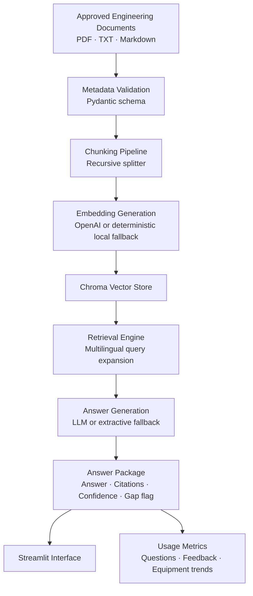

# Engineering Knowledge Assistant Architecture

## Design Notes

- Controlled corpus only. No web search.
- Source citations are preserved from document metadata through chunk retrieval.
- Knowledge-gap detection is based on retrieval score and source count, not model self-confidence.
- Corpus replacement requires updating document files and manifest metadata, not application code.
